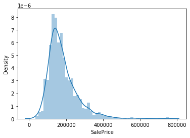
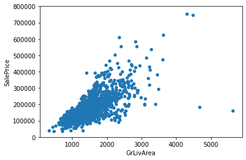
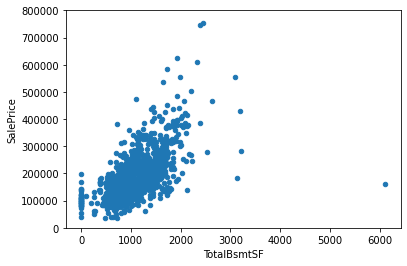
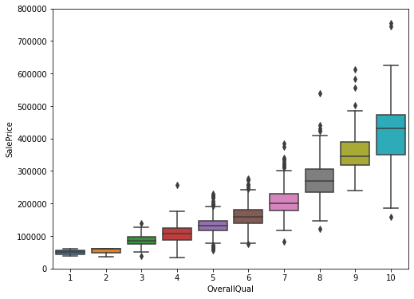
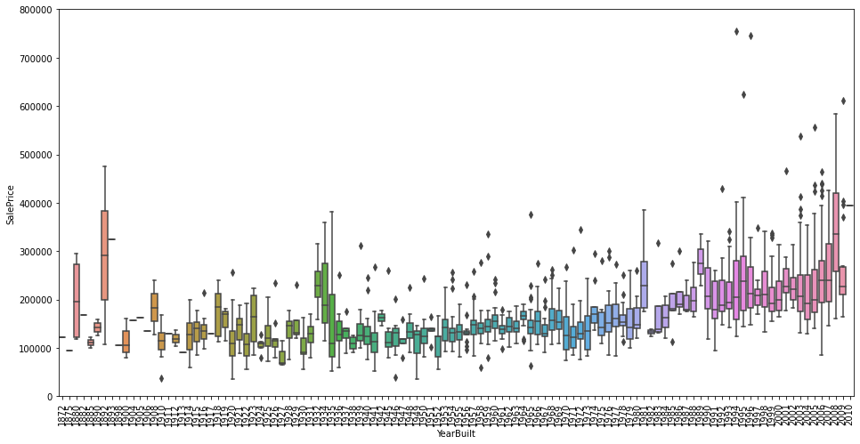
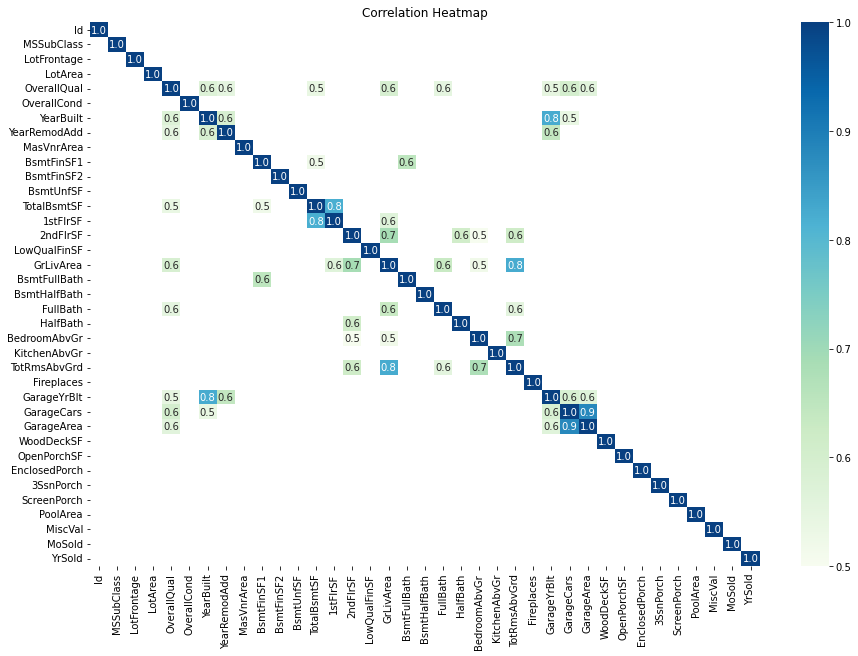

# Data exploration with python

***This project was designed to be a comprehensive analysis of the Housing Data in Iowa***. Our final goal is to accurately predict the SalePrice for each house, using the attributes provided in the dataset, and to achieve that we first have to establish a deep understanding of the data we are working with.

These are the steps that we will deploy:
- **Univariable study**. We'll just focus on the dependent variable ('SalePrice') and try to know a little bit more about it
- **Multivariate study**. We'll try to understand how the dependent variable and independent variables relate.
- **Basic cleaning**. We'll clean the dataset and handle the missing data, outliers and categorical variables.
- **Test assumptions**. We'll check if our data meets the assumptions required by most multivariate techniques.

Importing libraries and data


```python
import pandas as pd
import matplotlib.pyplot as plt
import seaborn as sns
import numpy as np
from scipy.stats import norm
from sklearn.preprocessing import StandardScaler
from scipy import stats
import warnings
warnings.filterwarnings('ignore')
%matplotlib inline
```


```python
#importing training data
df_train = pd.read_csv('Data/train.csv')
```


```python
#checking columns
df_train.columns
```


    Index(['Id', 'MSSubClass', 'MSZoning', 'LotFrontage', 'LotArea', 'Street',
           'Alley', 'LotShape', 'LandContour', 'Utilities', 'LotConfig',
           'LandSlope', 'Neighborhood', 'Condition1', 'Condition2', 'BldgType',
           'HouseStyle', 'OverallQual', 'OverallCond', 'YearBuilt', 'YearRemodAdd',
           'RoofStyle', 'RoofMatl', 'Exterior1st', 'Exterior2nd', 'MasVnrType',
           'MasVnrArea', 'ExterQual', 'ExterCond', 'Foundation', 'BsmtQual',
           'BsmtCond', 'BsmtExposure', 'BsmtFinType1', 'BsmtFinSF1',
           'BsmtFinType2', 'BsmtFinSF2', 'BsmtUnfSF', 'TotalBsmtSF', 'Heating',
           'HeatingQC', 'CentralAir', 'Electrical', '1stFlrSF', '2ndFlrSF',
           'LowQualFinSF', 'GrLivArea', 'BsmtFullBath', 'BsmtHalfBath', 'FullBath',
           'HalfBath', 'BedroomAbvGr', 'KitchenAbvGr', 'KitchenQual',
           'TotRmsAbvGrd', 'Functional', 'Fireplaces', 'FireplaceQu', 'GarageType',
           'GarageYrBlt', 'GarageFinish', 'GarageCars', 'GarageArea', 'GarageQual',
           'GarageCond', 'PavedDrive', 'WoodDeckSF', 'OpenPorchSF',
           'EnclosedPorch', '3SsnPorch', 'ScreenPorch', 'PoolArea', 'PoolQC',
           'Fence', 'MiscFeature', 'MiscVal', 'MoSold', 'YrSold', 'SaleType',
           'SaleCondition', 'SalePrice'],
          dtype='object')


In order to understand our data, we need to look at each variable and try to understand their meaning and relevance to the problem of predicting SalePrice. Reading through each attribute in the table, we need to understand:
- **Explaination**: Brief explaination of the attribute
- **Type**: Categorical or Numeric
- **Expectation**: Does the attribute has a great impact on our target (SalePrice)

For further analysis, we should read the description of all the variables and, one by one, ask ourselves:

Do we think about this variable when we are buying a house? (e.g. When we think about the house of our dreams, do we care about its 'Masonry veneer type'?).
If so, how important would this variable be? (e.g. What is the impact of having 'Excellent' material on the exterior instead of 'Poor'? And of having 'Excellent' instead of 'Good'?).
Is this information already described in any other variable? (e.g. If 'LandContour' gives the flatness of the property, do we really need to know the 'LandSlope'?).

Going through this process, we can use our intuition to conclude that the following variables can play an important role in this problem:

- OverallQual
- YearBuilt.
- TotalBsmtSF.
- GrLivArea.

## Analysiing SalePrice
We first need to understand the nature of our target


```python
df_train['SalePrice'].describe()
```


    count      1460.000000
    mean     180921.195890
    std       79442.502883
    min       34900.000000
    25%      129975.000000
    50%      163000.000000
    75%      214000.000000
    max      755000.000000
    Name: SalePrice, dtype: float64


```python
sns.distplot(df_train['SalePrice'])
```


    <AxesSubplot:xlabel='SalePrice', ylabel='Density'>


    

    


Seeing the distribution plot we can come to some conclusions that the data:
- *Deviate from the normal distribution.*
- *Have appreciable positive skewness.*
- *Show peakedness.*


```python
#skewness and kurtosis
print("Skewness: %f" % df_train['SalePrice'].skew())
print("Kurtosis: %f" % df_train['SalePrice'].kurt())
```

    Skewness: 1.882876
    Kurtosis: 6.536282
    

## Correlation between SalePrice and other attributes
Here we will try to analyse the **relationship** between our Target and the attributes that we have chosen above

### Grlivarea


```python
#scatter plot grlivarea/saleprice
var = 'GrLivArea'
data = pd.concat([df_train['SalePrice'], df_train[var]], axis=1)
data.plot.scatter(x=var, y='SalePrice', ylim=(0,800000));
```


    

    


The graph above shows a positive linear relationship between Grlivarea and SalePrice


```python
#scatter plot totalbsmtsf/saleprice
var = 'TotalBsmtSF'
data = pd.concat([df_train['SalePrice'], df_train[var]], axis=1)
data.plot.scatter(x=var, y='SalePrice', ylim=(0,800000));
```


    

    


Here we can also see a (much stronger) positive linear relationship, perhaps exponential

### Categorical Attributes


```python
#box plot overallqual/saleprice
var = 'OverallQual'
data = pd.concat([df_train['SalePrice'], df_train[var]], axis=1)
f, ax = plt.subplots(figsize=(8, 6))
fig = sns.boxplot(x=var, y="SalePrice", data=data)
fig.axis(ymin=0, ymax=800000);
```


    

    


```python
var = 'YearBuilt'
data = pd.concat([df_train['SalePrice'], df_train[var]], axis=1)
f, ax = plt.subplots(figsize=(16, 8))
fig = sns.boxplot(x=var, y="SalePrice", data=data)
fig.axis(ymin=0, ymax=800000);
plt.xticks(rotation=90);

```


    

    


Regarding our categorical attributes, Overall Quality seems to positively affect our SalePrice, while yearbuilt shows a weaker correlation.

## In Summary
- 'GrLivArea' and 'TotalBsmtSF' seem to be linearly related with 'SalePrice'. Both relationships are positive, which means that as one variable increases, the other also increases. In the case of 'TotalBsmtSF', we can see that the slope of the linear relationship is particularly high.
- 'OverallQual' and 'YearBuilt' also seem to be related with 'SalePrice'. The relationship seems to be stronger in the case of 'OverallQual', where the box plot shows how sales prices increase with the overall quality.

## Correlation maxtrix

The first part of the analysis uses our intuition to pick out 4 attributes (GrLivArea', 'TotalBsmtSF', OverallQual','YearBuilt') to analyse relationship with SalePrice, which can sometimes be inaccurate due to human bias. The next part, using correlation matrix, we can gain a much more objective look into the relationship between our target and the other variables


```python
# Create correlation matrix from train data excluding `SalePrice`
corr_mat = df_train.iloc[:, :-1].corr()

# Select correlations greater than 0.5
high_corr_mat = corr_mat[abs(corr_mat) >= 0.5]

# Plot correlation heatmap
plt.figure(figsize=(15, 10))
sns.heatmap(high_corr_mat,
            annot=True,
            fmt='.1f',
            cmap='GnBu',
            vmin=0.5,
            vmax=1)
title = plt.title('Correlation Heatmap')
```


    

    


At first sight, there are two bright blue colored squares that get my attention. The first one refers to the 'TotalBsmtSF' and '1stFlrSF' variables, and the second one refers to the 'GarageX' variables. Both cases show how significant the correlation is between these variables. This correlation indicates a situation of multicollinearity. If we think about these variables, we can conclude that they give almost the same information so multicollinearity really occurs. 


```python

```
